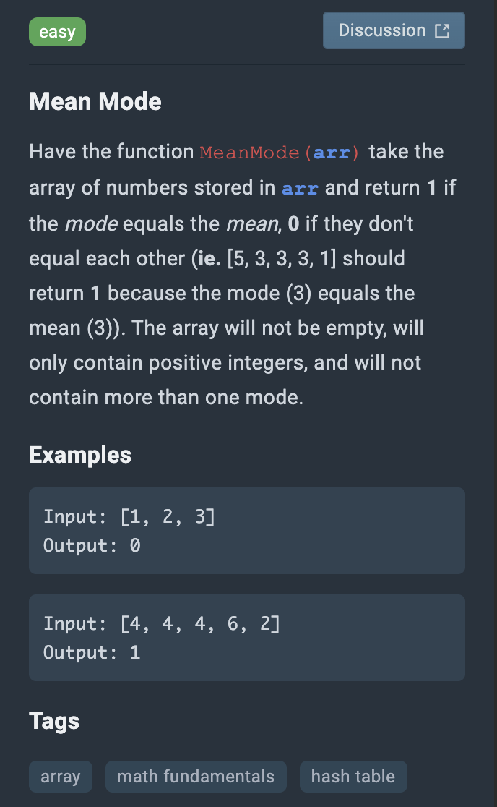

# Mean Mode



```js
Math.mean = (nums) => {
    let total = 0
    nums.map(num => total += num)

    return total/nums.length
}

Math.mode = (nums) => { //TODO will be fixed
    let freq = {}
    let max = nums[0]

    nums.map(num => freq[num] >=0 ? freq[num]++ : freq[num] = 1)

    for(let val in freq){if(freq[max] < freq[val]) max = val}

    return max
}

function MeanMode(arr) {
    const mean = Math.mean(arr)
    const mode = Math.mode(arr)

    return mean === mode ? 1 : 0
}
```