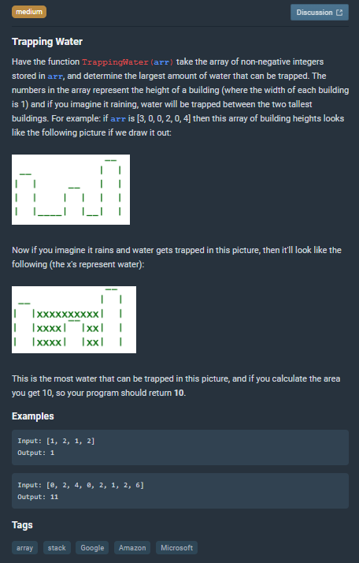

# Trapping Water


```js
function TrappingWater(arr) {
    let maxArea = 0

    for(let currentIndex = 0; currentIndex<arr.length; currentIndex++){
        let currentWidth = 1
        let rightIndex = currentIndex + 1
        let leftIndex = currentIndex - 1
        let cannotBeFilledArea = 0 // we will delete this areas while calculating max val

        //check current to right bins for max largest area
        while(rightIndex < arr.length && arr[rightIndex] < arr[currentIndex]){
            cannotBeFilledArea += arr[rightIndex]
            currentWidth++

            if(rightIndex === arr.length-1) currentWidth = 0 // if index is last and
            //still lower than current index, then requirements not OK

            rightIndex++
        }

        if(maxArea < (currentWidth * arr[currentIndex])){
            maxArea = Math.max((currentWidth * arr[currentIndex] -  cannotBeFilledArea - arr[currentIndex]), maxArea)
            currentWidth = 0
            cannotBeFilledArea = 0
        }

        //check current to left bins for max largest area
        while(leftIndex >= 0  && arr[leftIndex] < arr[currentIndex]){
            cannotBeFilledArea += arr[leftIndex]
            currentWidth++

            if(leftIndex === 0) currentWidth = 0 // if index is first and
            //still lower than current index, then requirements not OK

            leftIndex--
        }

        if(maxArea < (currentWidth * arr[currentIndex])){
            maxArea = Math.max((currentWidth * arr[currentIndex] -  cannotBeFilledArea - arr[currentIndex]), maxArea)
            currentWidth = 0
            cannotBeFilledArea = 0
        }
    }

    return maxArea
}
```